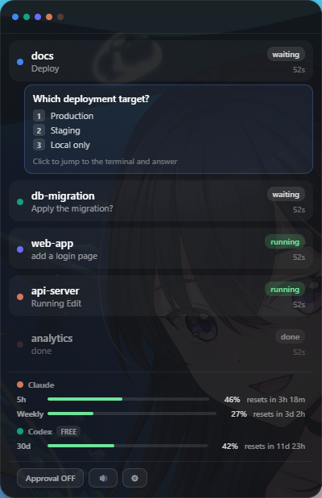

# Roost

A small always-on-top panel that shows what your AI coding agents are doing, without switching windows.

Claude Code, Codex CLI, Cursor and Gemini CLI all report into one place: which session is running, which one is waiting on you, what it's about to ask, and how much of your usage quota is left. Hover to expand, click a row to jump back to that terminal.

Windows only. Built with Tauri (Rust + React), ~11 MB installed.

[日本語版 README](README.ja.md)



It sits out of the way until you look at it:


A dot per agent, coloured by tool. Hover to get the panel above.

## Why

[Vibe Island](https://vibeisland.app) does this beautifully on macOS. There was no Windows equivalent, so this is one — with its own take on a few things:

- **Four agents, one panel.** Claude Code, Codex CLI, Cursor (the GUI IDE, not just the CLI), and Gemini CLI.
- **Usage quotas for Claude and Codex**, including the reset countdown.
- **Session history.** Finished sessions stay listed; anything still waiting on an answer is kept regardless of age, so you can leave and come back.
- **Approval mode is opt-in.** Off by default, because interrupting an autonomous agent on every tool call defeats the point of running one.

## Install

Grab the installer from [Releases](../../releases), or build it yourself:

```bash
npm install
npm run tauri build
```

> The installer is **unsigned**, so Windows SmartScreen will warn you. Click *More info* → *Run anyway*, or build from source if you'd rather not. Signing certificates cost money this project doesn't have.

Then wire up whichever agents you use:

```bash
npm run setup           # writes hook config for every agent it finds
npm run setup -- --dry-run   # preview without writing
npm run setup -- --remove    # take it back out
```

This edits `~/.claude/settings.json`, `~/.cursor/hooks.json` and `~/.gemini/settings.json` in place, keeping your existing config and backing up the original as `*.roost-backup`. Codex CLI needs one line pasted into `~/.codex/config.toml`; the script prints it.

Restart the agent (or reopen Cursor) afterwards.

The UI follows your OS language — English everywhere except Japanese Windows. Set `ROOST_LANG=en` or `ROOST_LANG=ja` to override.

## What it reads, and what leaves your machine

Worth being explicit about, since this reads credentials:

- **Everything is local.** Agents talk to Roost over `127.0.0.1`. Roost has no server, no account, no telemetry.
- **It reads your stored OAuth tokens** — `~/.claude/.credentials.json` and `~/.codex/auth.json` — to query *your own* usage from Anthropic and OpenAI. The tokens are used for those requests and nothing else. They are never written anywhere, logged, or sent to any third party. See [`src-tauri/src/usage.rs`](src-tauri/src/usage.rs).
- **Usage endpoints are undocumented.** Anthropic's `/api/oauth/usage` is internal, and Codex has no HTTP endpoint at all for current utilisation — Roost asks the local `codex app-server` the same way Codex's own TUI does. Both may break without notice; when they do, the bars just disappear.

## How agent integration works

Every agent gets a small Node bridge script that posts to Roost's local HTTP server. They're all fail-quiet: if Roost isn't running, the request times out in under a second and the agent carries on.

| Agent | Mechanism | Granularity |
|---|---|---|
| Claude Code | `hooks` in `settings.json` | Per tool call |
| Cursor | `hooks.json` (works in the GUI IDE) | Per tool call |
| Gemini CLI | `hooks` in `settings.json` | Per tool call |
| Codex CLI | `notify` in `config.toml` | Turn boundaries only |

### Approval mode

Off by default. When on, every tool call pauses until you click Allow or Deny in the panel. Each vendor spells the answer differently (`permissionDecision` / `permission` / `decision`), and only Claude and Cursor have a three-way `ask`.

The important rule: **only an explicit allow/deny counts.** A transport error, an empty response, or anything unparseable falls back to the agent's own prompt. Treating a hiccup as a denial would silently block work you never saw — that happened during development, and [`scripts/verify-hook-safety.mjs`](scripts/verify-hook-safety.mjs) now pins the behaviour.

There's also a tray item to turn approval mode off, so you can never lock yourself out of the switch.

## Known limitations

- **Jumping back focuses the terminal window, not the tab.** Windows Terminal shares one process across tabs, so there's no reliable way to tell them apart. The session row's tooltip shows the window title as a hint.
- **Cursor and Gemini haven't been tested against the real thing** — neither was installed on the development machine. Both are implemented from official docs and covered by [`scripts/verify-bridges.mjs`](scripts/verify-bridges.mjs) against stub payloads. Reports welcome.
- **Codex reports at turn boundaries only.** Its `notify` mechanism has no per-tool-call event.
- **Answering questions still happens in the terminal.** Roost shows `AskUserQuestion` prompts and their options, but answering from the panel would require synthesising keystrokes into whatever window happens to be focused. Not worth the risk of typing into the wrong app.

## Tests

```bash
npm test                          # bridge event mapping + approval safety
cd src-tauri && cargo test --lib  # usage alert thresholds
```

## License

MIT
